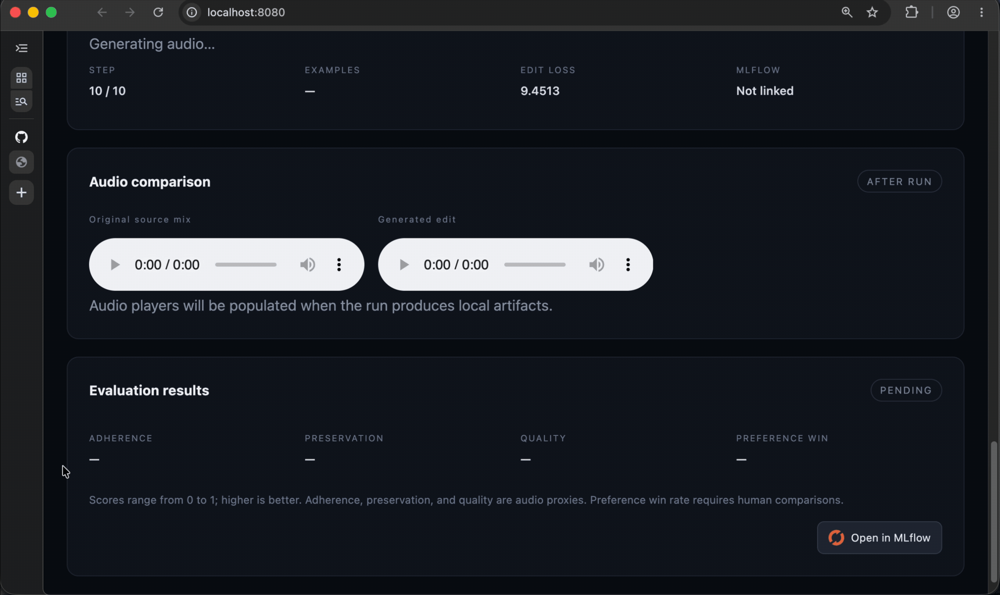

# Text-Guided Music Editing and Alignment

Research code for preservation-aware text-guided music editing. The prototype uses MusicGen-small with LoRA adapters and labeled add/remove/replace targets derived from a local Slakh/BabySlakh subset [[1]](#ref-1) [[4]](#ref-4).

The goal is to make a requested musical change while retaining the parts of the source that the instruction does not target. The repository covers the experimental path from manifest creation and deterministic target construction through adapter training, local inference, evaluation, and run tracking.

## Scope

The research question is whether lightweight adapter training can satisfy a requested edit while preserving non-target musical content. Raw audio, model weights, checkpoints, generated audio, manifests, and MLflow state remain outside Git.

This is a research prototype rather than a production audio editor. It currently focuses on short, mono, stem-based examples and three edit operations:

- **Add:** introduce a target stem into the source mixture.
- **Remove:** subtract a target stem while preserving the remaining mixture.
- **Replace:** exchange one target stem for another.

Target waveforms are built deterministically from source stems. MusicGen encodes the edit instruction, the pretrained base model remains frozen, and LoRA adapters provide the trainable parameters [[3]](#ref-3). Current adherence, preservation, and quality scores are useful experiment proxies, not comprehensive perceptual or semantic metrics.

## How it fits together

```text
Slakh/BabySlakh stems
        |
        v
metadata-only manifest --> deterministic source/target pairs
        |                              |
        +------------------------------+
                       |
                       v
        MusicGen-small + LoRA training
                       |
                       v
       generated audio + evaluation report
                       |
                       v
              UI / API / MLflow
```

The manifest is the contract between data preparation, training, and evaluation. It identifies the source audio, edit instruction, operation, target stem, expected target audio, and data split. Keeping this metadata separate from licensed audio makes the code and example schemas shareable without redistributing the dataset.

## Model architecture

`facebook/musicgen-small` is a composite conditional-generation model with three pretrained components [[1]](#ref-1) [[5]](#ref-5):

```text
edit instruction ──> frozen T5 encoder ───────────────┐
                                                      v
source waveform ──> frozen 32 kHz EnCodec ──> audio codes
                                                      |
                                                      v
                                      MusicGen Transformer decoder
                                      24 layers, width 1024, 16 heads
                                      4 delayed/interleaved codebooks
                                                      |
                                                      v
                                        predicted audio codes
                                                      |
                                                      v
                                      frozen EnCodec decoder ──> waveform
```

The T5 encoder converts the instruction into text hidden states. EnCodec converts a mono 32 kHz waveform into four streams of discrete codes sampled at 50 frames per second [[2]](#ref-2). The 300M-parameter MusicGen decoder autoregressively predicts the four delayed code streams, attending both to prior audio codes and to the text states. EnCodec then decodes the predicted codes into audio [[1]](#ref-1).

In this repository, the source mixture is supplied as an audio prompt and the deterministic edited waveform supplies the supervised target codes. The current generation path is therefore source-conditioned continuation, not a native arbitrary-span editor: it retains the generated continuation and compares it with a same-duration reference edit. That distinction is important when interpreting preservation scores and motivates the architecture directions below.

### Where LoRA is applied

The implementation in `src/train_musicgen_adapter.py` wraps the complete model with PEFT but targets modules named only `q_proj` and `v_proj`. In the pinned Transformers implementation, those names occur in the MusicGen decoder—not in T5 or EnCodec. An adapter is inserted into four projections per decoder layer:

```text
MusicGen decoder layer (repeated 24 times)
├── causal self-attention
│   ├── q_proj + LoRA rank 8
│   └── v_proj + LoRA rank 8
└── text cross-attention
    ├── q_proj + LoRA rank 8
    └── v_proj + LoRA rank 8
```

This gives 96 adapted linear projections and 1,572,864 trainable parameters with `r=8`, `lora_alpha=16`, and dropout `0.05`. The pretrained projection weights, T5 text encoder, EnCodec audio codec, embeddings, feed-forward blocks, attention key/output projections, and output heads remain frozen. Self-attention adapters can change how the model uses the source and previously generated audio tokens; cross-attention adapters can change how strongly and where the instruction affects generation.

## Layout

```text
configs/   Training configuration
docs/      Data protocol, training plan, and UI demonstrations
research/  Scope and roadmap
src/       Training, target construction, API, and evaluation
tests/     Dockerized test suite
ui/        Compact experiment dashboard
```

Notable entry points include `src/prepare_slakh_manifest.py` for dataset indexing, `src/train_musicgen_adapter.py` for labeled LoRA training, `src/evaluate_audio.py` for artifact-level evaluation, and `src/api.py` for experiment control.

## Prerequisites

- Docker with Compose for the reproducible test, API, UI, and MLflow services.
- Python 3 and Apple Silicon for the native MPS workflow, or a CUDA-capable environment with the GPU Compose override.
- A local, appropriately licensed Slakh/BabySlakh-style dataset.
- A locally cached `facebook/musicgen-small` checkpoint for offline training.

## Quick start

```bash
make build
make test
make device
```

Docker on macOS does not expose Apple MPS; use native Python for local M1/M2/M3 training.

Useful commands are discoverable with `make help`. Run the GPU-backed test container on a compatible cloud host with `make cloud-test`.

## Prepare local data

Keep licensed BabySlakh/Slakh files outside the repository, for example `/Users/moseskim/Downloads/babyslakh_16k`. Create the metadata-only manifest with:

```bash
make prepare-data \
  DATASET_ROOT=/Users/moseskim/Downloads/babyslakh_16k \
  SUBSET=data/derived.jsonl
```

`data/derived.jsonl` records example IDs, source paths, edit instructions, operations, target stems, and splits. It contains no audio. Validate it with:

```bash
docker compose run --rm research python src/validate_manifest.py data/derived.jsonl
```

Never commit the generated manifest or audio files.

The checked-in files under `data/*.example.jsonl` document the expected schemas and support validation and evaluation tests without requiring the private dataset. See [the data protocol](docs/data_protocol.md) for provenance, split, licensing, and preference-annotation rules.

## Native MPS setup

```bash
make native-install
make native-device
```

The MusicGen-small checkpoint must already be in the local Hugging Face cache; training uses local-only model loading.

## Training

Training uses deterministic labeled edit targets. For one selected example:

```bash
.venv-macos/bin/python src/train_musicgen_adapter.py data/derived.jsonl \
  --example-id Track00001_S02_add --steps 10 --duration-seconds 10 --device mps
```

For a small multi-example pool:

```bash
.venv-macos/bin/python src/train_musicgen_adapter.py data/derived.jsonl \
  --limit 3 --steps 3 --duration-seconds 10 --device mps
```

The default UI example is `Track00001_S02_add` (S02 piano; S01 drums). Outputs are written under ignored `outputs/runs/latest/`.

A run produces source and reference audio, the generated edit, and an evaluation JSON report. These artifacts are intentionally ignored because they may be large or derived from licensed source material.

## UI and API

Start the native API and Docker UI in separate terminals:

```bash
make api-native
make ui
```

Open [http://localhost:8080](http://localhost:8080). The UI validates the edit contract, reports training/generation phases, and displays original/generated audio and evaluation results.

```bash
curl http://localhost:8000/health
curl http://localhost:8000/device
curl -s http://localhost:8000/experiments/status | python -m json.tool
```

### Training


### Evaluation



## MLflow

```bash
make mlflow
```

Open [http://localhost:5000](http://localhost:5000). If that port is occupied:

```bash
MLFLOW_PORT=5001 docker compose up -d mlflow
```

Then open [http://localhost:5001](http://localhost:5001). MLflow data is stored in Docker volumes.

## Evaluation

The API evaluates generated artifacts after a run. To evaluate them directly:

```bash
.venv-macos/bin/python src/evaluate_audio.py \
  outputs/runs/latest/source.wav \
  outputs/runs/latest/reference_target.wav \
  outputs/runs/latest/generated_edit.wav \
  --output outputs/runs/latest/evaluation.json
```

Reports include 0–1 adherence, preservation, and quality audio proxies; higher is better. Preference win rate remains unavailable until blinded human preference labels exist. Aggregate scored JSONL results with `make evaluate`.

| Metric | Interpretation |
| --- | --- |
| Edit Success Rate | Fraction of edits judged successful and valid |
| Text-Music Alignment | Similarity between instruction and generated audio |
| Preservation Score | Similarity of non-target content before and after editing |
| Fréchet Audio Distance | Distributional distance from reference audio; lower is better |
| Preference Win Rate | Fraction of blind comparisons preferred over the baseline |

Metrics must be reported jointly; higher adherence is not an improvement if preservation or quality decreases.

For reproducible comparisons, keep the base checkpoint, preprocessing, decoding settings, data split, and random seed fixed. Report results by edit operation as well as in aggregate, and use held-out songs rather than stems from songs seen during training.

## Current capabilities

- Metadata-only labeled manifests with split-leakage validation.
- Deterministic add/remove/replace target rendering.
- MusicGen-small LoRA training on labeled targets.
- Single-example and multi-example local MPS runs.
- Dockerized API, UI, tests, and MLflow service.
- Audio artifact generation and evaluation reports.

## Future work

Work should proceed from a reliable LoRA baseline to measured adapter improvements, then to broader evaluation:

- **Stabilize adapter training:** add padded mini-batches, gradient accumulation, multi-epoch sampling, validation loss, checkpoint selection, and deterministic seeds. This creates a repeatable baseline before changing the model or objective.
- **Train for both editing and preservation:** supplement target-code prediction with an explicit loss on untouched content. Report the edit and preservation terms separately so that improved instruction adherence cannot hide damage to the source mixture.
- **Strengthen evaluation and tracking:** replace the current audio proxies with frozen text-audio and perceptual-quality evaluators, score held-out songs by edit operation, and log configuration, checkpoints, artifacts, and metrics to MLflow. Add small blinded listening tests with confidence intervals once automatic evaluation is stable.
- **Explore preference optimization last:** collect validated blind preference pairs only after the supervised baseline is reproducible. Use them to refine the best adapter configuration rather than introducing preference training and architecture changes at the same time.

### Incremental architecture improvements

The practical next step is to improve the existing MusicGen + LoRA approach, not replace it with a new generator:

- **Tune adapter capacity:** compare a small set of ranks and scaling factors while keeping the training data and decoding settings fixed.
- **Test nearby adapter locations:** compare the current query/value adapters with adapters on all attention projections or selected feed-forward layers, using a similar trainable-parameter budget.
- **Add explicit edit conditioning:** represent add, remove, and replace as learned operation tokens alongside the text instruction so the same adapter can distinguish the three edit behaviors more reliably.

Choose the next configuration using joint adherence, preservation, quality, memory, and latency results. Change one factor at a time and retain the current query/value-only setup as the baseline.

See [research/roadmap.md](research/roadmap.md), [docs/data_protocol.md](docs/data_protocol.md), and [docs/training_plan.md](docs/training_plan.md) for details.

## References

1. <a id="ref-1"></a>Copet, J. et al. (2023). [Simple and Controllable Music Generation](https://arxiv.org/abs/2306.05284). MusicGen architecture, conditioning, codebook-delay pattern, and model scaling.
2. <a id="ref-2"></a>Défossez, A. et al. (2022). [High Fidelity Neural Audio Compression](https://arxiv.org/abs/2210.13438). EnCodec neural audio compression and discrete representations.
3. <a id="ref-3"></a>Hu, E. J. et al. (2021). [LoRA: Low-Rank Adaptation of Large Language Models](https://arxiv.org/abs/2106.09685). Low-rank, parameter-efficient adaptation of frozen model weights.
4. <a id="ref-4"></a>Manilow, E. et al. (2019). [Cutting Music Source Separation Some Slakh: A Dataset to Study the Impact of Training Data Quality and Quantity](https://www.merl.com/publications/TR2019-124). Slakh dataset construction and aligned multitrack data.
5. <a id="ref-5"></a>Hugging Face. [MusicGen model documentation](https://huggingface.co/docs/transformers/model_doc/musicgen) and [`facebook/musicgen-small` model card](https://huggingface.co/facebook/musicgen-small). Composite Transformers implementation and checkpoint details.
